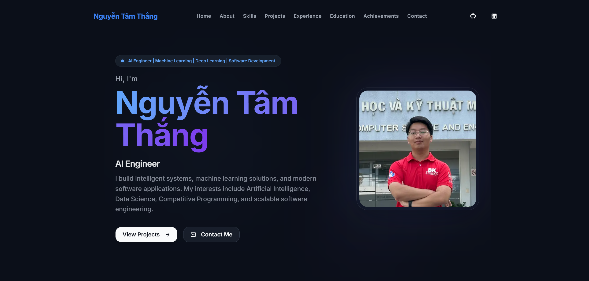

<div align="center">
  
  
  
  

  <h1>✨ My Personal Portfolio ✨</h1>
  <p>A premium, highly interactive personal portfolio website designed to showcase my projects and skills as an AI Engineer.</p>

  <a href="https://nguyentamthang.vercel.app/" target="_blank"><strong>View Live Demo »</strong></a>
  <br />
  <br />

  <!-- Insert a screenshot of your portfolio here -->
  
</div>

<br />

## 🚀 Overview

This repository contains the source code for my personal portfolio. Designed with a focus on modern aesthetics, smooth micro-animations, and optimal performance, it serves as a digital resume and a showcase of my technical capabilities.

## ✨ Features

- **Dark Mode First**: Beautiful dark-themed UI with meticulously chosen color palettes.
- **Smooth Animations**: Page transitions, scroll reveals, and hover effects powered by `framer-motion`.
- **Responsive Design**: Flawless layout across all devices (Mobile, Tablet, Desktop).
- **Performance Optimized**: Built on Next.js App Router with optimized images and fonts.
- **Dynamic Sections**: Complete timeline for Education & Experience, plus an interactive Projects showcase.

## 🛠️ Tech Stack

- **Framework**: [Next.js](https://nextjs.org/) (App Router)
- **Language**: [TypeScript](https://www.typescriptlang.org/)
- **Styling**: [Tailwind CSS v4](https://tailwindcss.com/)
- **Animations**: [Framer Motion](https://www.framer.com/motion/)
- **Icons**: [Lucide React](https://lucide.dev/)
- **Deployment**: [Vercel](https://vercel.com/)

## 🏃‍♂️ Getting Started

To run this project locally on your machine, follow these steps:

### 1. Clone the repository
```bash
git clone https://github.com/Thazg/Portfolio.git
cd Portfolio/my-portfolio
```

### 2. Install dependencies
```bash
npm install
```

### 3. Run the development server
```bash
npm run dev
```

Open [http://localhost:3000](http://localhost:3000) with your browser to see the result. You can start editing the page by modifying `src/app/page.tsx`.

## 📁 Project Structure

```text
src/
├── app/          # Next.js App Router layout and pages
├── components/   # Reusable UI components (buttons, layout)
├── sections/     # Major page sections (Hero, Experience, Education)
└── ...
```

## 📬 Contact

- **Facebook**: [Thắng Nguyễn](https://www.facebook.com/ntt0512/)
- **LinkedIn**: [thangnguyen0512](https://www.linkedin.com/in/thangnguyen0512/)
- **Portfolio**: [nguyentamthang.vercel.app](https://nguyentamthang.vercel.app/)
